# suno-prep

A tool that helps you upload songs to Suno when it complains that your song is recognized as existing work.

---


## Using Prebuilt Binary With Suno

This is the exact workflow:

1. Run `suno-prep` on your source song
2. Upload one of the down-pitched outputs into Suno Studio
3. Use that uploaded to transpose back up inside Suno as needed (one time, two times, etc...)
4. Export the finished up-transposed version of the song
5. Be creative!

The screenshot sequence below uses the Windows build and uses the `_down-26` file as the example clip.

### Step 1 — Open the GitHub release page

Open the repo and go to the latest release on the right side of the page.

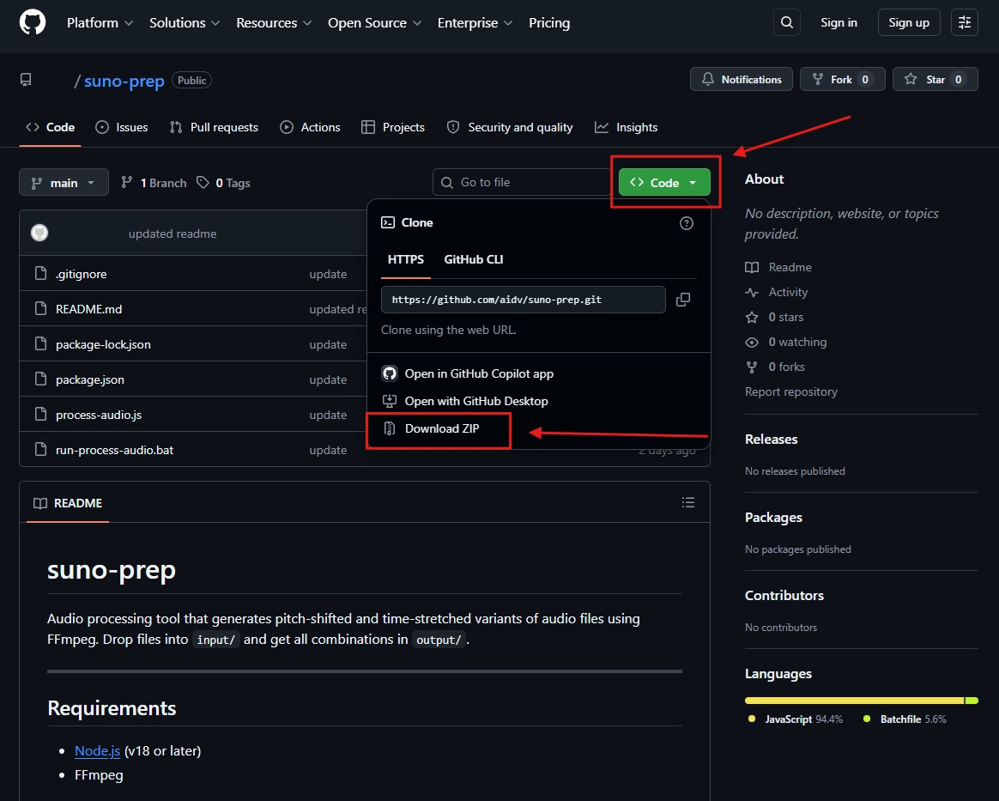

### Step 2 — Download the binary for your OS

From the release assets, download `suno-prep-win.zip` on Windows or `suno-prep-mac.zip` on macOS.

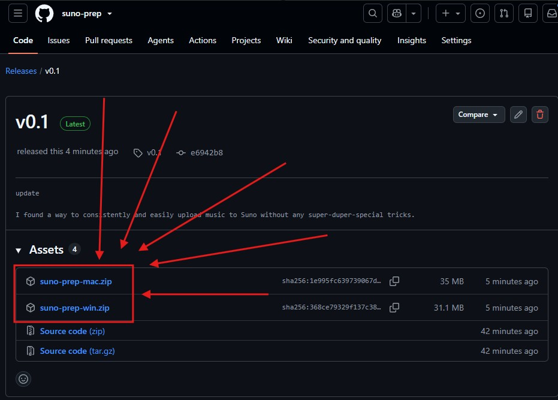

### Step 3 — Run the app on your source song

Open a terminal in the repo folder and run the binary against your source file. Example on Windows:

```powershell
.\suno-prep-win.exe "input/ehmjay-bow.mp3"
```

The app will download `ffmpeg` and `ffprobe` into `libs/` if they are missing, then it will write the processed files into `output/`.

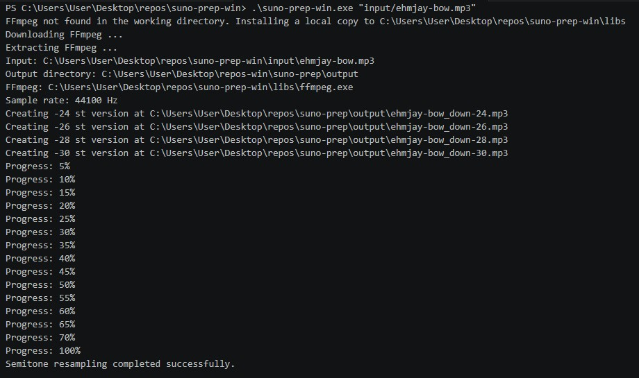

### Step 4 — Open Suno Studio

In Suno, go to **Studio** from the left sidebar.


### Step 5 — Create a new Studio project

Open the project menu and create a **New Project** so you are working in a clean timeline.

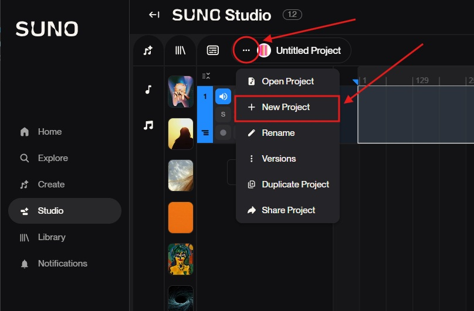

### Step 6 — Add one processed output to the timeline

Take one of the generated files from `output/` and drag it into the Studio timeline. The screenshot sequence uses the `*_down-26.mp3` file as the example.

IMPORTANT TO KNOW: For this document we use `*_down-26.mp3` which the original audio file has been transposed **DOWN** by 26 semitones because sometimes Suno still detects songs even if they are transposed down 24 semitones, so I needed to use the -26 version of the song.

This will require that step 7 and 8 are repeated as seen in this document at step 11 through 15. You'll get the idea.

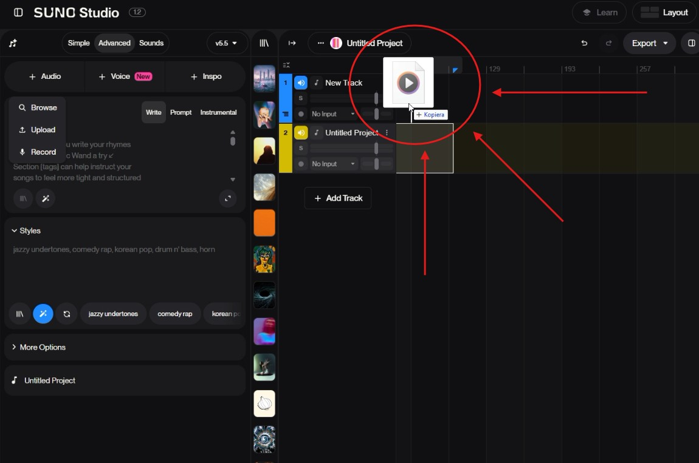

### Step 7 — Wait for the upload and set transpose to `+24`

After the clip is on the timeline, select it and set **Transpose** to `+24` in the clip settings on the right.

This screenshot specifically shows `SONG_DOWN-26.MP3` being uploaded while the transpose control is set to `+24`.

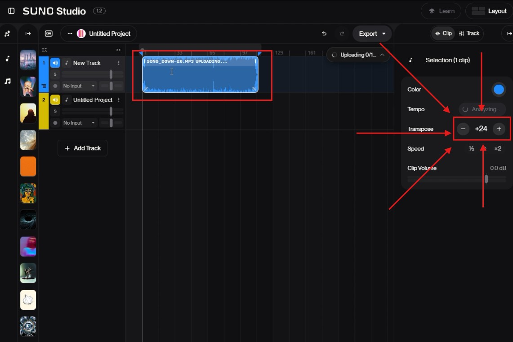

### Step 8 — Export the selected time range of the uploaded clip

Select the full time range covered by the uploaded clip, then use **Export > Selected Time Range**.

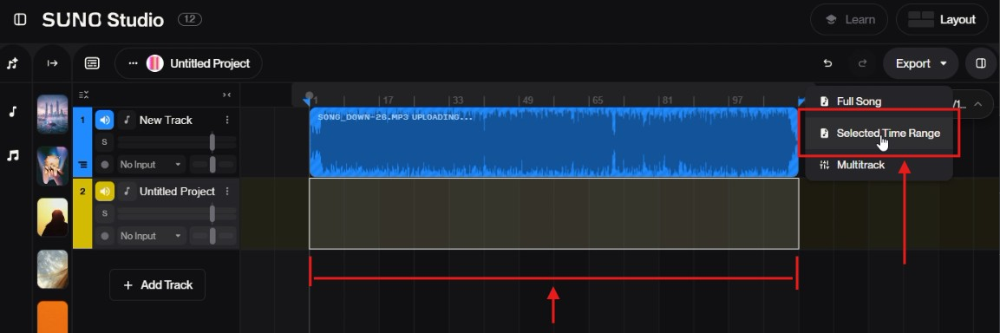

### Step 9 — Open the Audio picker in Studio

Back in the Studio project, click **Audio** in the left panel so you can pick audio from your uploads/project list.

IMPORTANT TO KNOW: Sometimes your exported timeline selection will not show up in the audio library, to fix this we need to
manually select the file in the audio picker.

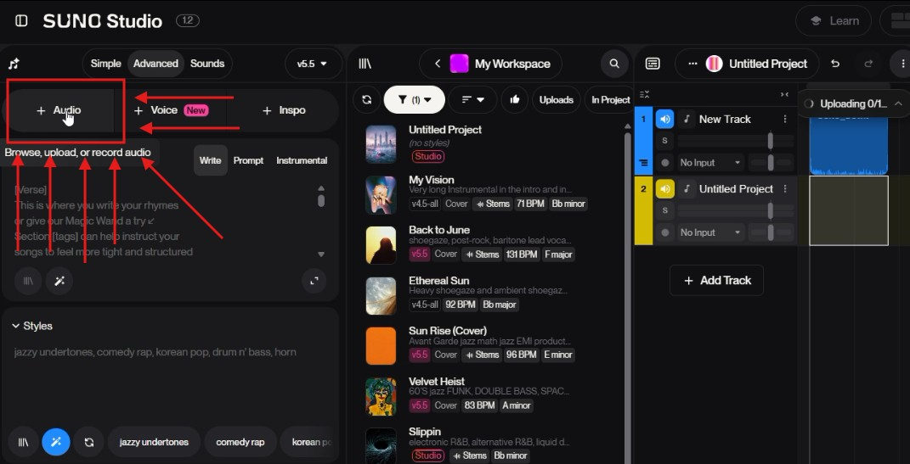

### Step 10 — Choose the uploaded song to remix

In the picker, find the uploaded song and choose it as the remix source.

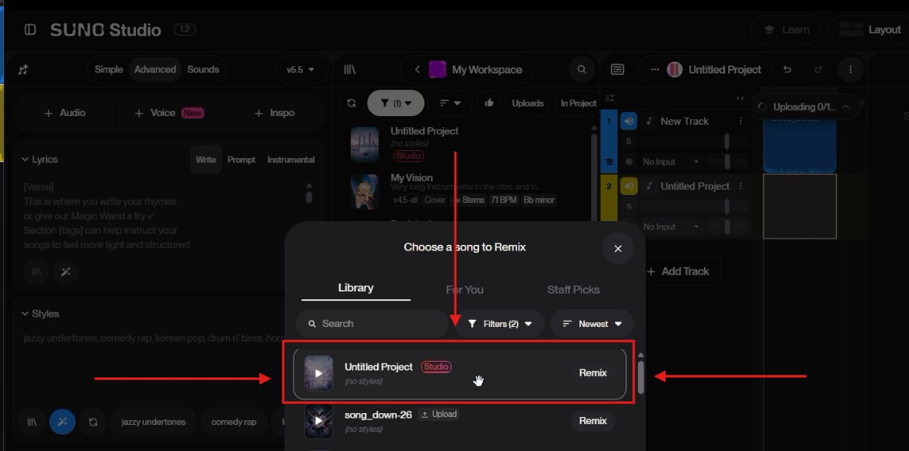

### Step 11 — Confirm the uploaded audio is the source for the project

After selecting it, the clip appears as the active audio source in the left panel. Keep the project in **Cover** mode as shown.

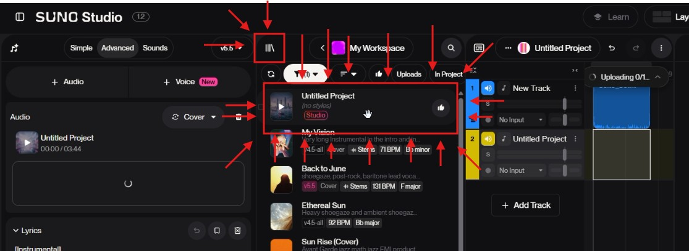

### Step 12 — Place the generated clip into the lower track area

Once the clip is available in the project, position it in the lower track lane so it lines up with the section you want to work with.

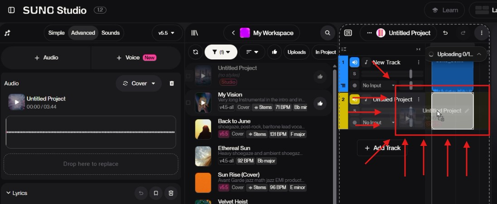

### Step 13 — Set the Suno-generated clip transpose to `+2`

Select the yellow clip on the timeline and set **Transpose** to `+2` in the clip settings.

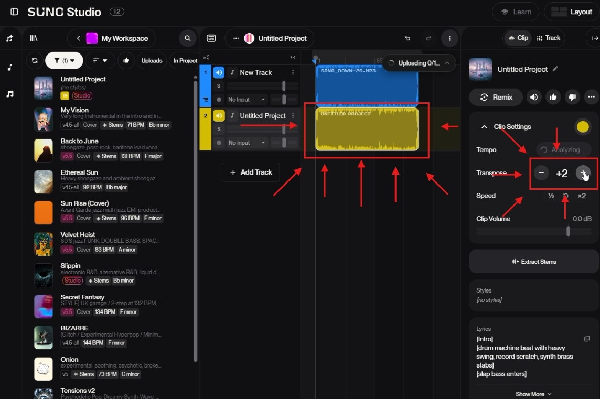

### Step 14 — Mute the original track and select only the final clip range

Mute the upper/original track and highlight only the range of the lower generated clip that you want to export.

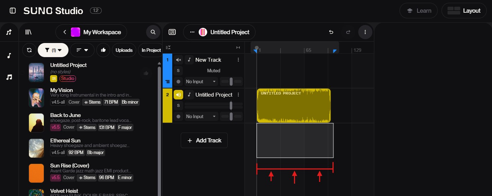

### Step 15 — Export the final selected range

Use **Export > Selected Time Range** to export the final Suno result.

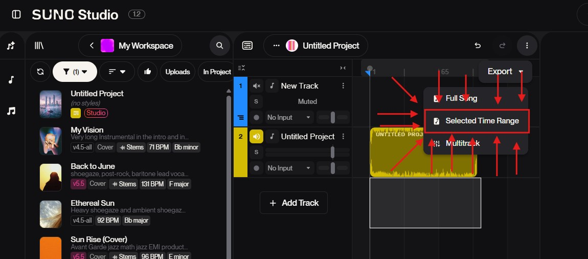

### Step 16 — COMPLETED!!!

Now you can remix your song as you wish.


### Practical Notes

- The screenshot flow uses the `_down-26` output as the example, but the app also generates `_down-24`, `_down-28`, and `_down-30` by default.
- If one version does not behave the way you want in Suno, repeat the same Studio workflow with one of the other generated outputs.
- The app writes processed files into `output/` by default.
- If `ffmpeg` is missing, the app downloads local binaries into `libs/` automatically.

---

# Developer mode

## Requirements

- [Node.js](https://nodejs.org/) (v18 or later)
- FFmpeg

The app does not use a global FFmpeg installation. It looks only in the current working directory: first for `ffmpeg` and `ffprobe` directly in the folder, then in `libs/`. If they are missing, the app automatically downloads an OS-appropriate local copy into `libs/` in the working directory and uses that instead.

To package the app into binaries with Node SEA, run `npm run build:binaries`. This writes:

- `dist/suno-prep-win.exe`
- `dist/suno-prep-mac`

---

## Step 1 — Install FFmpeg

### Windows

1. Go to https://www.gyan.dev/ffmpeg/builds/ and download **ffmpeg-release-essentials.zip**
2. Extract the zip
3. Copy `ffmpeg.exe` from the `bin/` folder inside the zip
4. Paste it into `C:\Windows\System32\`
5. Open a new Command Prompt and verify:
   ```
   ffmpeg -version
   ```

### macOS

```bash
# Download the pre-built binary
curl -L https://evermeet.cx/ffmpeg/getrelease/ffmpeg/zip -o ffmpeg.zip

# Unzip
unzip ffmpeg.zip

# Move to bin
sudo mv ffmpeg /usr/local/bin/

# Verify
ffmpeg -version
```

---

## Step 2 — Install Node dependencies

In the project folder, run:

```bash
npm install
```

---

## Step 3 — Add input files

Place your audio files (e.g. `.mp3`, `.wav`) into the `input/` folder.

---

## Step 4 — Run
Use `app.js` to create resampled versions of a song.

- By default it creates `-24` semitones
- By default it creates `-26` semitones
- By default it creates `-28` semitones
- By default it creates `-30` semitones

If you want a single specific pitch shift instead, pass `--semitones <value>`.

### Run

```bash
node app.js input/song.mp3 --output-dir output
```

For a custom shift:

```bash
node app.js input/song.mp3 --output-dir output --semitones 7
```

You can also run it through npm:

```bash
npm run resample-octaves -- input/song.mp3 --output-dir output
```

Or:

```bash
npm run resample-octaves -- input/song.mp3 --output-dir output --semitones -5
```

### Options

- `-o, --output-dir <directory>`: optional output directory; defaults to the repo `output/` directory
- `-s, --semitones <value>`: optional semitone shift; when set, the script generates only that one resampled version

With the default behavior, the script writes:

- `<input>_down-24<ext>`
- `<input>_down-26<ext>`
- `<input>_down-28<ext>`
- `<input>_down-30<ext>`

With `--semitones 7`, it writes:

- `<input>_up-7<ext>`

